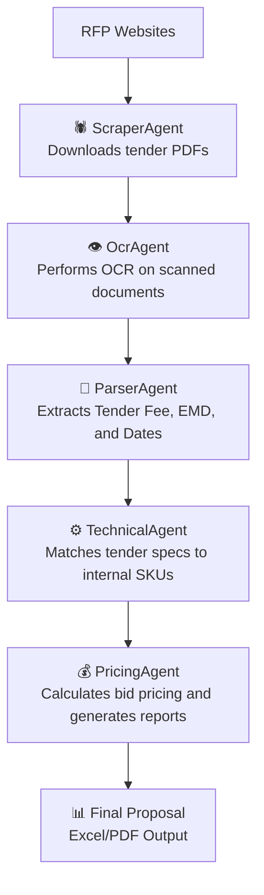

# 🤖 RFP Automation using Agentic AI

This project automates the **Request for Proposal (RFP)** lifecycle using an **Agentic AI architecture** — a collection of autonomous agents that work together to scrape, extract, analyze, and generate bid-ready proposals from public tenders.

---

## 🧩 System Architecture

The system is composed of modular **AI Agents**, each responsible for a specific part of the workflow:

| Agent | Responsibility |
|--------|----------------|
| 🕷️ **ScraperAgent** | Finds and downloads RFP/tender PDFs from official procurement portals |
| 👁️ **OcrAgent** | Detects scanned/image-based PDFs and converts them into searchable text using OCR (Tesseract) |
| 🧾 **ParserAgent** | Extracts structured data such as Tender Fee, EMD, Dates, and Description |
| ⚙️ **TechnicalAgent** | Matches extracted specs with internal SKUs using fuzzy text matching |
| 💰 **PricingAgent** | Calculates estimated bid prices and generates pricing sheets |
| 🧠 **BackboneAgent** | Acts as the central coordinator, controlling all agents |

---

## 🧠 Workflow Overview


---

## Technologies Used

This project leverages a robust, modern **Python-based technology stack** that combines automation, AI, and intelligent document understanding. Core frameworks include **Playwright** and **BeautifulSoup** for dynamic web scraping and HTML parsing, enabling the system to efficiently discover and extract RFP data from government and enterprise portals. PDF parsing and text extraction are powered by **PyMuPDF (fitz)**, while **Tesseract OCR** and **pdf2image** handle image-based or scanned tenders by converting them into searchable text. Data cleaning, manipulation, and structured output generation are achieved through **pandas** and **OpenPyXL**, ensuring seamless Excel and CSV integration.  

For intelligent analysis, **RapidFuzz** performs fuzzy string matching to link tender specifications with internal SKUs, while lightweight **Natural Language Processing (NLP)** techniques—using tokenization, keyword extraction, and semantic similarity—enhance the matching accuracy and contextual understanding of tender descriptions. The architecture follows an **Agentic AI** design pattern, where specialized agents independently perform scraping, parsing, matching, and pricing tasks under a central **Backbone Coordinator**.  

By blending concepts from **multi-agent systems**, **intelligent document processing (IDP)**, and **AI-driven automation**, this project delivers a scalable, fully autonomous solution for real-time RFP discovery, analysis, and bid generation.


---

## File Structure
```
rfp-automation-agentic-ai/
│ 
├── agents/ # All AI agents (autonomous modules)
│ ├── scraper_agent_playwright.py # Scrapes and downloads tender PDFs 
│ ├── ocr_agent.py # Performs OCR on scanned PDFs 
│ ├── parser_agent.py # Extracts structured info (Tender Fee, EMD, Dates)
│ ├── technical_agent.py # Matches tender specs with product SKUs 
│ └── pricing_agent.py # Generates pricing and bid sheets 
│ 
├── data/ # Storage for input/output data 
│ ├── rfps/ # Downloaded raw RFP PDFs 
│ ├── parsed_rfps.csv # Extracted tender data
│ ├── matched_tenders.csv # Product–tender match results
│ └── bid_pricing.xlsx # Final pricing output 
│ 
├── main.py # Central coordinator (BackboneAgent) 
├── requirements.txt # Project dependencies 
├── .gitignore # Git ignore file to exclude data/logs 
└── README.md # Project documentation 
```
---

## 🧩 Installation
1. Clone the repository

```
git clone https://github.com/YOUR_USERNAME/rfp-automation-agentic-ai.git
cd rfp-automation-agentic-ai
```
2. Create Virtual Environment

```
python -m venv .venv
source .venv/bin/activate      # Mac/Linux
.venv\Scripts\activate         # Windows
```
3. Install Dependencies

```
pip install -r requirements.txt
```
