# 🤖 RFP Automation using Agentic AI

This project automates the **Request for Proposal (RFP)** lifecycle using an **Agentic AI architecture** — a collection of autonomous agents that work together to scrape, extract, analyze, and generate bid-ready proposals from public tenders.

---

## 🧩 System Architecture

The system is composed of modular **AI Agents**, each responsible for a specific part of the workflow:

| Agent | Responsibility |
|--------|----------------|
| 🕷️ **ScraperAgent** | Finds and downloads RFP/tender PDFs from official procurement portals |
| 👁️ **OcrAgent** | Detects scanned/image-based PDFs and converts them into searchable text using OCR (Tesseract) |
| 🧾 **ParserAgent** | Extracts structured data such as Tender Fee, EMD, Dates, and Description |
| ⚙️ **TechnicalAgent** | Matches extracted specs with internal SKUs using fuzzy text matching |
| 💰 **PricingAgent** | Calculates estimated bid prices and generates pricing sheets |
| 🧠 **BackboneAgent** | Acts as the central coordinator, controlling all agents |

---

## 🧠 Workflow Overview

```mermaid
graph TD
    A[RFP Websites] --> B[🕷️ ScraperAgent<br/>Downloads tender PDFs]
    B --> C[👁️ OcrAgent<br/>Performs OCR on scanned documents]
    C --> D[🧾 ParserAgent<br/>Extracts Tender Fee, EMD, and Dates]
    D --> E[⚙️ TechnicalAgent<br/>Matches tender specs to internal SKUs]
    E --> F[💰 PricingAgent<br/>Calculates bid pricing and generates reports]
    F --> G[📊 Final Proposal<br/>Excel/PDF Output]
```


---

## 🧩 Installation
1. Clone the repository

```
git clone https://github.com/YOUR_USERNAME/rfp-automation-agentic-ai.git
cd rfp-automation-agentic-ai
```
2. Create Virtual Environment

```
python -m venv .venv
source .venv/bin/activate      # Mac/Linux
.venv\Scripts\activate         # Windows
```
3. Install Dependencies

```
pip install -r requirements.txt
```
